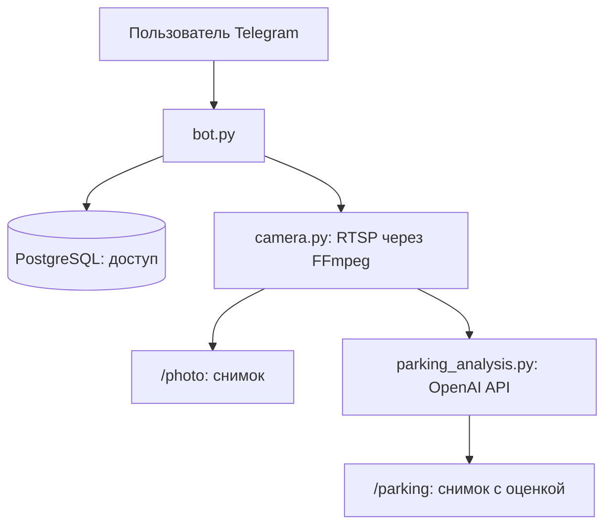

# Parking Bot

Telegram-бот для снимков дворовой парковки с IP-камеры. `/photo` отправляет
текущий кадр; `/parking` оценивает занятость видимых мест и подсвечивает их на
снимке. Вторая команда использует OpenAI API и включается только при наличии
ключа.

## Как устроен

Бот получает обновления Telegram через long polling. PostgreSQL содержит только
список разрешённых Telegram ID; администратор имеет доступ по
`admin_telegram_id` и управляет списком командами `/add_user <id>`,
`/remove_user <id>`, `/list_users`. Кадр передаётся в памяти, история кадров и
оценок не сохраняется. Отдельный Telegram-бот пересылает администратору события
по `logging_bot_token`.

## Запуск

1. Скопируйте `.env.example` в `.env` и заполните токены, Telegram ID
   администратора и адрес RTSP-камеры. `.env` не добавляйте в Git.
2. Для анализа снимка дополнительно укажите `openai_api_key`. Подписка ChatGPT
   не оплачивает вызовы OpenAI API: нужен отдельный ключ и баланс API.
3. Запустите `docker compose up -d --build`.

В текущем `docker-compose.yml` база создаётся с `postgres` / `postgres` и
именем `parking_bot`; поэтому значения `db_user`, `db_password`, `db_name` в
`.env` должны им соответствовать, а `db_host` внутри контейнера равен `db`.
При существующем томе PostgreSQL смена переменных Compose сама по себе не
меняет пароль пользователя базы.

### Команды

- `/start` — показать кнопки доступному пользователю.
- `/photo` — получить свежий кадр без анализа и внешнего AI-запроса.
- `/parking` — получить свежий кадр, оценку занятости и подсветку мест.

Один запрос `/parking` отправляет кадр в OpenAI API и расходует платные токены.
Глобальный интервал между запросами задаётся `parking_cooldown_seconds` (по
умолчанию 60 секунд). Анализ не делает парковку законной и не гарантирует
наличия места: модель может ошибаться в числе мест, границах и статусе, особенно
ночью, под снегом и при перекрытии обзора. Жёлтый цвет означает «неясно»;
оценка уверенности самой модели не является измеренной точностью. Места
определяются заново на каждом кадре и не имеют постоянных номеров.

Для надёжного подсчёта именно **ваших** мест следующим шагом нужен пример кадра
с камеры и размеченные постоянные зоны парковки. На нескольких дневных и ночных
снимках можно сравнить результат с фактом и выбрать порог и способ распознавания.

Документация: [визуальный ввод](https://developers.openai.com/api/docs/guides/images-vision),
[структурированный вывод](https://developers.openai.com/api/docs/guides/structured-outputs),
[тарифы OpenAI API](https://openai.com/api/pricing/).
